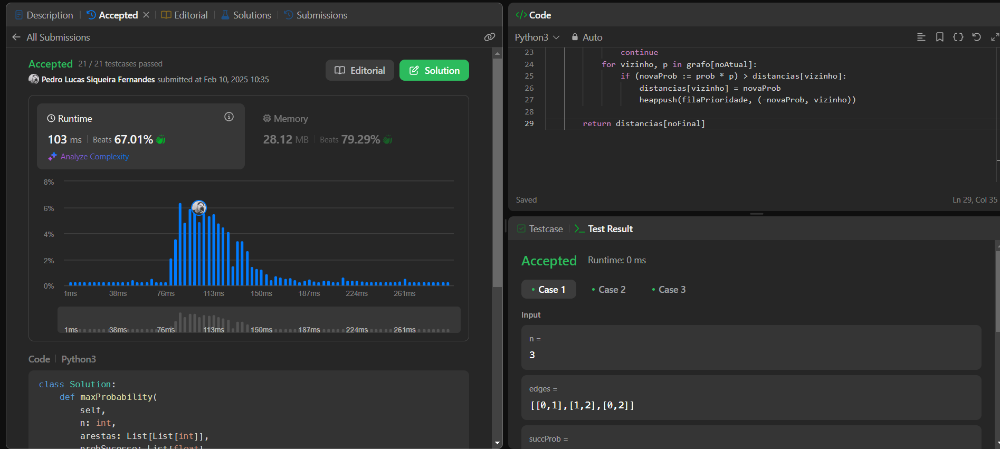
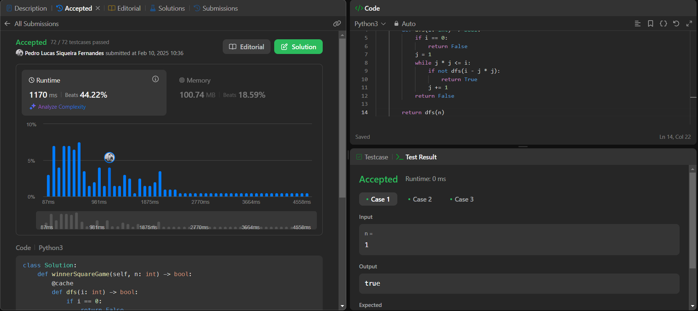

# Exercicios LeetCode

**Número da Lista**: 44 
**Conteúdo da Disciplina**: Programação Dinamica 

## Alunos

|Matrícula | Aluno |
| -- | -- |
| 19/0115564  |  Pedro Lucas Siqueira Fernandes |
| 19/0030755  |  João Paulo Lima da Silva |

## Questões

| Nome  | Nível   |
| ---------------------- | ------- |
| [1235. Maximum Profit in Job Scheduling](https://leetcode.com/problems/maximum-profit-in-job-scheduling/description/) | Hard |
| [787. Cheapest Flights Within K Stops](https://leetcode.com/problems/cheapest-flights-within-k-stops/description/)| Medium | 
| [1514. Path with Maximum Probability](https://leetcode.com/problems/path-with-maximum-probability/description/) | Medium |
| [1510. Stone Game IV](https://leetcode.com/problems/stone-game-iv/description/) | Hard |

## Vídeo

## Screenshots

## Instalação

Linguagem = Python  
Framework = Nenhum 

## Uso

Acesse os Links e execute no juíz online.